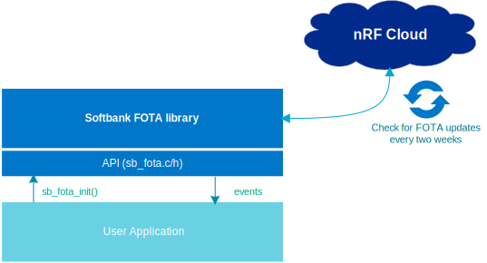

.. _sb_fota_integration:

Application Integration and Configuration
#########################################

Overview
========

SoftBank specifies that your certified product must be able to update its modem firmware, regardless of the tasks run by your application.
The SoftBank FOTA library is an independent library that is intended to run together with your application when included in your project. See the below image.

   Interaction between the SoftBank FOTA library and the user application

OS layer
========

The SoftBank FOTA library has an OS abstraction layer.
This abstraction layer makes the SoftBank FOTA library independent of some |NCS| modules and underlying implementation of primitives such as timers, non-volatile storage, and heap allocation.
For more information, see the :file:`sb_fota_os.h` file or the :ref:`sb_fota_os` section for available APIs. It provides an abstraction of the following modules:

* |NCS| modules:

  * TODO: Move Link Controller here.

* Zephyr modules:

  * `Logging`_
  * `Kernel`_
  * `Settings subsystem <Settings_>`_

The following modules are used directly by the library.

  * `AT Monitor`_
  * `AT Parser`_
  * `FOTA Download`_
  * `HTTP Client`_
  * `JSON`_
  * `PDN`_
  * `Modem JWT`_
  * `Modem Information`_
  * `LTE Link Control`_
  * `nrfxlib_nrf_modem`_

When the SoftBank FOTA library is enabled in your application, it includes the file :file:`sdk-softbank-fota/lib/bin/sb_fota/os/sb_fota.c`.
This automatically runs the library's main function (:c:func:`sb_fota_main`).

.. _sb_fota_configuration:

Configuration
*************

Enable the library in your application by setting the ``CONFIG_SB_FOTA`` Kconfig option to ``y``.

The :ref:`sb_fota_sample` project configuration (:file:`sdk-softbank-fota/sample/prj.conf`) contains all the configurations that are needed by the SoftBank FOTA library.

By default, sec_tag 50 is used for JWT signing and TLS. This can be changed with ``CONFIG_SB_FOTA_JWT_SECURITY_TAG`` and ``CONFIG_SB_FOTA_TLS_SECURITY_TAG``

Usage
*****

To use this library, the application must set the Kconfig option ``CONFIG_SB_FOTA`` to ``y`` and then register a callback for the library using :c:func:`sb_fota_init` function.
This is demonstrated in the following example and it is based on the assumption that you are initializing the `nrfxlib_nrf_modem`_ and LTE connection when the device boots:

.. code-block:: c

    static void softbank_fota_callback(enum sb_fota_event e)
    {
       switch(e) {
       case SB_FOTA_EVENT_DOWNLOADING:
          printk("SB_FOTA_EVENT_DOWNLOADING\n");
          break;
       case SB_FOTA_EVENT_IDLE:
          printk("SB_FOTA_EVENT_IDLE\n");
          break;
       case SB_FOTA_EVENT_MODEM_SHUTDOWN:
          printk("SB_FOTA_EVENT_MODEM_SHUTDOWN\n");
          break;
       }
    }

    int main(void)
    {
       if (sb_fota_init(&softbank_fota_callback) != 0) {
          printk("Failed to initialize the SoftBank FOTA library\n");
          return 1;
       }
       ...
    }

Requirements and limitations
============================

The application can control the modem usage normally, like any application based on the |NCS|, but with the following limitations:

* Occasionally, the library might need to connect to `nRF Cloud`_ to check and possibly download a new modem firmware image.
  It issues the :c:enum:`SB_FOTA_EVENT_DOWNLOADING` event when it starts the download.
  At that time, application must not use any TLS sockets that are using offloaded TLS stack from the modem.
  Also, it is recommended to stop all network operations until the :c:enum:`SB_FOTA_EVENT_IDLE` event is received, as there might be mandatory operation mode switches between NB-IoT and LTE-M networks.

* When the modem is updated with a new firmware, it gets disconnected from the network and shuts down.
  This is indicated by the :c:enum:`SB_FOTA_EVENT_MODEM_SHUTDOWN` event.
  The modem update can take a few minutes.

It is recommended to register an event handler using the :c:func:`sb_fota_init` API.

Configuration options
*********************

* ``CONFIG_SB_FOTA`` - Enables the SoftBank FOTA library
* ``CONFIG_SB_FOTA_AUTOINIT`` - Initializes the library automatically
* ``CONFIG_SB_FOTA_TLS_SECURITY_TAG`` - Security tag (``sec_tag``) for nRF Cloud TLS connection
* ``CONFIG_SB_FOTA_JWT_SECURITY_TAG`` - ``sec_tag`` for authentication with the cloud.
* ``CONFIG_SB_FOTA_CLIENT_ID`` - Determines which client ID (UUID or IMEI) will be used for nRF Cloud.
* ``CONFIG_SB_FOTA_ID_PREFIX`` - Prefix for the client ID.
